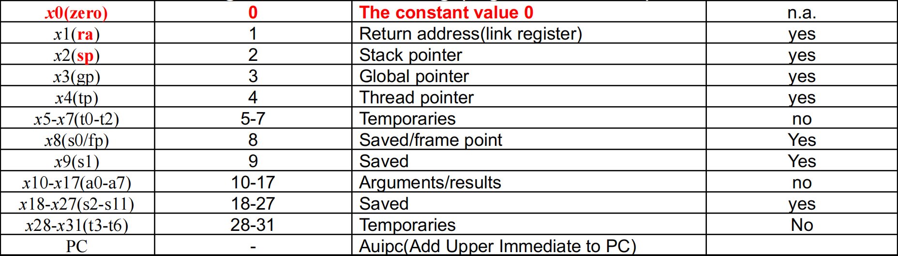

<div class="middle center">
<div style="width: 100%">

# 题目讲解


<hr/>

By [@李雅茜](https://github.com/Melody12020831)

Note:
汇编转C

</div>
</div>

<!--s-->

<div class="middle center">
<div style="width: 100%">

# 2.4

</div>
</div>


<!--v-->

## Question

> For the RISC-V assembly instructions below, what is the corresponding C statement? Assume that the variables f, g, h, i, and j are assigned to registers x5, x6, x7, x28, and x29, respectively. Assume that the base address of the arrays A and B are in registers x10 and x11, respectively.

<div class="mul-cols">
<div class="col">

```assembly
slli x30, x5, 3
add x30, x10, x30
slli x31, x6, 3
add x31, x11, x31
ld x5, 0(x30)
addi x12, x30, 8
ld x30, 0(x12)
add x30, x30, x5
sd x30, 0(x31)
```

</div>

<div class="col">

```assembly
// x30 = f*8
// x30 = &A[f]
// x31 = g*8
// x31 = &B[g]
// f = A[f]
```

</div>
</div>

Note:
下面的 RISC-V 汇编说明，对应的 C 语句是什么？假设变量 f、g、h、i 和 j 分别分配给寄存器 x5、x6、x7、x28 和 x29。假设数组 A 和 B 的基址分别位于寄存器 x10 和 x11 中。

<!--v-->

## Answer

<div class="mul-cols">
<div class="col">

```assembly
slli x30, x5, 3
```

</div>

<div class="col">

```assembly
x30 = f*8
```

<div class="fragment fade-up">

- 这是题目已经标注出来的

</div>
</div>
</div>
<div class="mul-cols">
<div class="col">
<div class="fragment fade-up">

`slli — Shift Left Logical Immediate`

</div>
<div class="fragment fade-up">

- `slli rd, rs1, imm`
    - rd：目标寄存器（存储结果）。
    - rs1：源寄存器（提供原始值）。
    - imm：立即数，指定左移的位数。

</div>
</div>
<div class="col">
<div class="fragment fade-up">

`srai — Shift right arithmetic immediate`

</div>
<div class="fragment fade-up">

- `srai rd, rs1, imm`
    - rd：目标寄存器（存储结果）。
    - rs1：源寄存器（提供原始值）。
    - imm：立即数，指定左移的位数。

</div>
</div>
</div>

<div class="fragment fade-up">

关于：

</div>

<div class="fragment fade-up">

- 右移算术移位：符号位（最高位）不变，向右移位后，空出的高位用符号位的值填充（符号扩展）。

</div>

<div class="fragment fade-up">

- 右移逻辑移位：高位一律补 0，移位后数值可能发生变化。

</div>

</div>

Note:
当然了也有逻辑右移，不过相似，不再赘述。有逻辑移也有算数移。

<!--v-->

<div class="mul-cols">
<div class="col">

```assembly
add x30, x10, x30
```

</div>

<div class="col">

```assembly
x30 = &A[f]
```

</div>
</div>
<div class="fragment fade-up">

- 在内存中，数组是连续存储的。数组中每个元素的地址可以根据以下公式计算：

$$元素地址=基地址+(元素索引×每个元素的字节大小)$$

</div>
<div class="fragment fade-up">

- `add` 把 `x10` 中存的(也即数组 A 的基地址) 的值与 `x30` (也即 `f` 变量的值 * 8 后)的值相加
- 这个操作是我们经常要做的，因为在内存中地址是以字节为单位的
- 得到的是 数组 A 中第 f 个元素的地址 `x30 = &A[f]`

</div>
<br><br>
<div class="fragment fade-up">

同理可得以下两行汇编的结果：

<div class="mul-cols">
<div class="col">

```assembly
slli x31, x6, 3
add x31, x11, x31
```

</div>

<div class="col">

```assembly
x31 = g*8
x31 = &B[g]
```

</div>
</div>
</div>

<!--v-->

<div class="mul-cols">
<div class="col">

```assembly
ld x5, 0(x30)
```

</div>

<div class="col">

```assembly
x5 = Memory[x30]= Memory[&A[f]] = A[f]
```

</div>

</div>

<div class="fragment fade-up">

- `ld` 是加载指令，从地址 `x30` (也即 `&A[f]` ) 加载数据到寄存器 `x5`

</div>
<div class="fragment fade-up">

- 其实从上四行代码的移位已经可以看出，数组 A 中的元素被假设为 64 位（8 字节）。这也与此处的 `ld` 指令 (`load double word`) 相呼应。

</div>
<div class="fragment fade-up">

| 数据类型         | 每个元素字节大小 | 左移位数    |
| :------------: | :------------: | :--------: |
| `char`（8 位）   | 1 字节           | 0（不移动） |
| `short`（16 位） | 2 字节           | 1           |
| `int`（32 位）   | 4 字节           | 2           |
| `long`（64 位）  | 8 字节           | 3           |

</div>
<div class="fragment fade-in-then-out">
<div style = "width:60%">



</div>

- 存到 `x5` 里面，也即 `f` 变量中了。（其实你可以发现 `x5` 也是 `t0` ，写到这里偶然发现，于本题没什么用处）
- 因为后面已经不需要用到 `f` 变量本来代表的值了。

</div>

Note:
不知道你会不会有疑问，反正我这里是有疑问的，为什么是左移三位，也就是×8呢。一个 `load doubble word` 所以是双字，也可以说明数组 A 是 long 型数组

<!--v-->

<div class="mul-cols">
<div class="col">

```assembly
addi x12, x30, 8
```

</div>
<div class="col">
<div class="fragment fade-up" data-fragment-index="1">

```assembly
x12 = &A[f ] + 8   |   x12 = &A[f + 1]
```

</div>
</div>
</div>
<div class="fragment fade-up" data-fragment-index="0">

- `x30` 中存的是 `&A[f]`

</div>
<div class="fragment fade-up" >

- 同理可得：

<div class="mul-cols">
<div class="col">

```assembly
ld x30, 0(x12)
```

</div>
<div class="col">


```assembly
x30 = Memory[x12] = Memory[&A[f+1]] = A[f + 1]
```

</div>
</div>

- 从地址 `x12` (也即 `&A[f+1]` ) 加载数据到寄存器 `x30`

</div>

<div class="fragment fade-up" >
<div class="mul-cols">
<div class="col">

```assembly
add x30, x30, x5
```

</div>
<div class="col">


```assembly
x30 = A[f] + A[f + 1]
```

</div>
</div>

- `x30` 中本来存的是 `A[f+1]`
- `x5` 中存的是 `A[f]`

</div>

<!--v-->

<div class="mul-cols">
<div class="col">

```assembly
sd x30, 0(x31)
```

</div>

<div class="col">

```assembly
Memory[&B[g]] = B[g] = A[f] + A[f + 1]
```

</div>

</div>

<div class="fragment fade-up">

- `x30` 中存的是 `A[f] + A[f + 1]`
- `x31` 中存的是 `&B[g]` 
- `sd` 是存储指令，将寄存器 `x30` 的值存储到寄存器 `x31` 中的值所指向的内存地址

</div>
<div class="fragment fade-up">

- 所以最终答案：

```assembly
B[g] = A[f] + A[f + 1];
```
</div>

<!--s-->

<div class="middle center">
<div style="width: 100%">

# 2.8

</div>
</div>

<!--v-->

## Question

> Translate the following RISC-V code to C. Assume that the variables f, g, h, i, and j are assigned to registers x5, x6, x7, x28, and x29, respectively. Assume that the base address of the arrays A and B are in registers x10 and x11, respectively.

```assembly
addi x30, x10, 8
addi x31, x10, 0
sd x31, 0(x30)
ld x30, 0(x30)
add x5, x30, x31
```

Note:
将以下 RISC-V 代码转换为 C。假设变量 f、g、h、i 和 j 分别分配给寄存器 x5、x6、x7、x28 和 x29。假设数组 A 和 B 的基址分别位于寄存器 x10 和 x11 中。

<!--v-->

## Answer

<div class="mul-cols">
<div class="col">

```assembly
addi x30, x10, 8
```

</div>
<div class="col">
<div class="fragment fade-up" data-fragment-index="1">

```assembly
x30 = x10 + 8   |   x30 = &A[1]
```

</div>
</div>
</div>
<div class="fragment fade-up" data-fragment-index="0">

- `x10` 中存的是数组 A 的基地址，也即 `&A` 或 `&A[0]`
- 可以通过下面的 `ld` 指令看出其实数组 A 中的元素大小是 8 个字节
- 所以 `x30` 中存 `x10 + 8` 即数组 A 中第 1 个元素的地址 `&A[1]` 

</div>
<div class="fragment fade-up">

- 同理可得：

<div class="mul-cols">
<div class="col">

```assembly
addi x31, x10, 0
```

</div>
<div class="col">

```assembly
x31 = x10 + 0 = x10   |   x31 = &A[0]
```

</div>
</div>

- `x31` 中存数组 A 中的第 0 个元素的地址 `&A[0]`

</div>
</div>

<!--v-->

<div class="mul-cols">
<div class="col">

```assembly
sd x31, 0(x30)
```

</div>

<div class="col">
<div class="fragment fade-up" data-fragment-index="1">

```assembly
Memory[x30] = x31
Memory[&A[1]] = A[1] = &A[0]

```

</div>
</div>
</div>
<div class="fragment fade-up" data-fragment-index="0">

- `x30` 中存的是 `&A[1]`
- `x31` 中存的是 `&A[0]` 
- `sd` 将寄存器 `x31` 中的值存储到由寄存器 `x30` 中的值所指向的内存地址中

</div>
<div class="mul-cols">
<div class="col">
<div class="fragment fade-up" data-fragment-index="2">

```assembly
ld x30, 0(x30)
```

</div>
</div>
<div class="col">
<div class="fragment fade-up" data-fragment-index="4">

```assembly
x30 = Memory[x30] = &A[0]
```

</div>
</div>
</div>
<div class="fragment fade-up" data-fragment-index="3">

- 从上一条指令得到 `Memory[x30]` 中存储的是 `&A[0]`
- `ld` 是加载指令，从寄存器 `x30` 中的值 所指向的内存地址 的数据 加载到寄存器 `x30`

</div>
<div class="mul-cols">
<div class="col">
<div class="fragment fade-up" data-fragment-index="5">

```assembly
add x5, x30, x31
```

</div>
</div>
<div class="col">
<div class="fragment fade-up" data-fragment-index="7">

```assembly
x5 = f = &A[0] + &A[0] = 2 * &A[0]
```

</div>
</div>
</div>
<div class="fragment fade-up" data-fragment-index="6">

- `x30` 中存的是  `&A[0]`
- `x31` 中存的是 `&A[0]`

</div>
<div class="fragment fade-up">

- 所以最终答案：

```assembly
f = 2 * &A[0];
```
</div>


